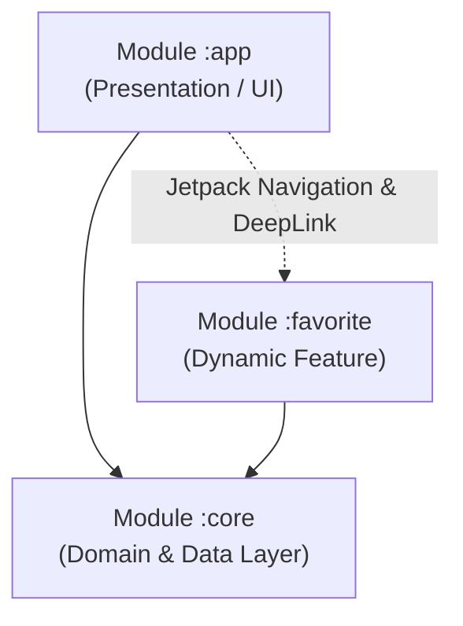

# CineVerse

CineVerse adalah aplikasi katalog film Android yang dibangun menggunakan **TheMovieDB (TMDb) API**. Proyek ini dibuat untuk memenuhi submission **Capstone Project** pada kelas Menjadi Android Developer Expert di Dicoding.

Aplikasi ini mengimplementasikan standar arsitektur modern Android, meliputi **Clean Architecture**, **Modularization (Multi-Module & Dynamic Feature)**, **Reactive Programming dengan Coroutines & Flow**, **Dependency Injection dengan Koin**, serta aspek **Security** dan **Performance**.

---

## Screenshots

| Home (Katalog Film) | Detail Movie | Live Search | Favorites (Offline Room) |
| :---: | :---: | :---: | :---: |
|  |  |  |  |

---

## Fitur Utama & Fitur Tambahan

1. **Katalog Film (Home)**:
   - Menampilkan daftar film populer, sedang tayang (*Now Playing*), dan rating tertinggi (*Top Rated*) menggunakan category filter.
   - Dilengkapi *featured banner* di bagian atas.
2. **Detail Film**:
   - Menampilkan informasi lengkap: poster, backdrop, sinopsis (*storyline*), rating, dan jumlah ulasan.
   - Tombol Floating Action Button (FAB) untuk menyimpan atau menghapus film dari daftar favorit.
   - Tombol Share untuk membagikan info film ke aplikasi lain.
3. **Favorite Movie (Dynamic Feature Module `:favorite`)**:
   - Menampilkan daftar film yang telah disimpan pengguna ke database lokal Room.
   - Dapat diakses secara offline.
4. **Live Search**:
   - Pencarian film secara real-time menggunakan reactive stream `debounce(300ms)` untuk mengurangi beban request ke network.
5. **UI & UX**:
   - Tema gelap (*Dark Theme*).
   - Efek *Shimmer loading* untuk placeholder saat memuat data.
   - Penanganan *empty state* dan *error state* dengan tombol *Try Again*.

---

## Arsitektur & Modularisasi

Aplikasi ini menggunakan **Clean Architecture** yang dibagi ke dalam 3 modul:

```text
Capstone/
├── app/                  # Base Application / Presentation Layer (UI, ViewModel, NavGraph)
├── core/                 # Android Library Module (Data, Domain, Network, Database, DI)
└── favorite/             # Dynamic Feature Module (Halaman Favorit & On-demand DI)
```



### Pemisahan Model (3 Distinct Models)
Untuk mematuhi prinsip Clean Architecture, model dipisahkan pada setiap layernya:
- **Data Layer**: `MovieResponse` (DTO network) dan `MovieEntity` (Entity Room database).
- **Domain Layer**: `Movie` (Pure Kotlin domain model tanpa dependensi framework).
- **Presentation Layer**: `MovieUiModel` (Model siap pakai untuk UI).
- Dihubungkan menggunakan `DataMapper` di modul `:core` dan `DomainToPresentationMapper` di modul `:app`.

---

## Kriteria Capstone Akhir

### 1. Jetpack Navigation Antar Module
- Menggunakan `DynamicNavHostFragment` pada `activity_main.xml`.
- Navigasi ke modul Dynamic Feature `:favorite` menggunakan Navigation Graph (`nav_graph.xml`) dan DeepLink `cineverse://favorite`.

### 2. Security
- **Database Encryption**: Database Room dienkripsi menggunakan **SQLCipher** (`net.zetetic:android-database-sqlcipher:4.5.4`) dengan `SupportFactory` — lihat `core/src/main/java/com/example/capstone/core/di/CoreModule.kt`.
- **Certificate Pinning**: Menggunakan OkHttp `CertificatePinner` dengan SHA-256 public key hash dari SSL TMDb API (`api.themoviedb.org`) — file yang sama.
- **Code Obfuscation (ProGuard / R8)**: Diaktifkan di **seluruh module**, pada buildType **debug maupun release**. Detail lengkap di bagian [Obfuscation di Seluruh Module](#obfuscation-di-seluruh-module).
- **Backup hardening**: Database terenkripsi dikecualikan dari Auto Backup & device transfer (`app/src/main/res/xml/backup_rules.xml` dan `data_extraction_rules.xml`).

### 3. Performance & Memory Leak (LeakCanary)
- Menerapkan **LeakCanary** (`leakcanary-android:2.14`) pada `debugImplementation`.
- Seluruh adapter dan binding didetach pada `onDestroyView()` untuk memastikan **0 Distinct Leaks**.
- **Android Lint: 0 issue kategori Performance.** Lihat bagian [Hasil Android Lint](#hasil-android-lint).

<p align="center">
  
</p>

### 4. Continuous Integration (CI)
Menggunakan **GitHub Actions** (`.github/workflows/android.yml`). Setiap push/pull request menjalankan:

| Tahap | Perintah | Keterangan |
| --- | --- | --- |
| Static analysis | `./gradlew lint` | Semua module, `checkDependencies = true` |
| Unit test | `./gradlew testDebugUnitTest` | `:core` + `:app` |
| Build debug | `./gradlew assembleDebug bundleDebug` | Sudah ter-obfuscate (R8 aktif di debug) |
| Universal APK | `bundletool build-apks --mode=universal` | Termasuk dynamic feature `:favorite` |
| Build release | `./gradlew assembleRelease bundleRelease` | R8 + resource shrinking |

Artefak yang diunggah: APK/AAB, laporan lint, laporan unit test, dan **file `mapping.txt` R8** sebagai bukti obfuscation.

---

## Obfuscation di Seluruh Module

Obfuscation dikerjakan oleh **R8**, dan konfigurasinya berbeda per tipe module. Ringkasannya:

| Module | Tipe | `isMinifyEnabled` (debug) | `isMinifyEnabled` (release) | File rules |
| --- | --- | :---: | :---: | --- |
| `:app` | `com.android.application` | ✅ `true` | ✅ `true` | `app/proguard-rules.pro` |
| `:core` | `com.android.library` | ✅ `true` | ✅ `true` | `core/proguard-rules.pro` + `core/consumer-rules.pro` |
| `:favorite` | `com.android.dynamic-feature` | ⛔ tidak boleh di-set | ⛔ tidak boleh di-set | `favorite/proguard-rules.pro` |

### Kenapa `:favorite` tidak menyetel `isMinifyEnabled`?

Android Gradle Plugin **menolak** dynamic feature module yang menyetel `isMinifyEnabled = true` dan menggagalkan build dengan pesan:

```text
Dynamic feature modules cannot set minifyEnabled to true.
minifyEnabled is set to true in build type 'debug'.
To enable minification for a dynamic feature module,
set minifyEnabled to true in the base module.
```

Sesuai instruksi AGP tersebut, minifikasi `:favorite` dijalankan oleh R8 milik **base module `:app`** (yang sudah `true` di debug dan release). File `favorite/proguard-rules.pro` tetap dibaca dan digabungkan ke proses R8 base module.

### Catatan penting soal buildType `debug`

`isMinifyEnabled = true` sudah aktif di `debug`, sehingga R8 **berjalan** (shrinking + optimization + pembacaan seluruh keep rules). Namun AGP secara sengaja **tidak me-rename simbol pada varian yang `debuggable`**, agar stack trace tetap terbaca saat debugging. Hal ini terlihat pada `mapping.txt`:

```text
# debug   -> pemetaan identitas (R8 jalan, nama tidak di-rename)
com.example.capstone.core.data.MovieRepositoryImpl -> com.example.capstone.core.data.MovieRepositoryImpl:

# release -> nama benar-benar di-obfuscate
com.example.capstone.core.utils.Resource            -> g1.d:
com.example.capstone.core.domain.usecase.MovieInteractor -> f1.a:
com.example.capstone.favorite.FavoriteViewModel     -> j1.l:
```

Untuk memverifikasi obfuscation secara langsung, gunakan build release:

```bash
./gradlew assembleRelease
grep -v " -> com\.example" app/build/outputs/mapping/release/mapping.txt | grep "^com\.example"
```

---

## Hasil Android Lint

`./gradlew lint` dijalankan dengan `checkDependencies = true` sehingga `:app`, `:core`, dan `:favorite` masuk dalam satu laporan.

| Kategori | Sebelum | Sesudah |
| --- | :---: | :---: |
| Performance | 20 | **0** |
| — Overdraw | 7 | 0 |
| — Missing `baselineAligned` | 3 | 0 |
| — Unused resources | 10 | 0 |
| Internationalization (`HardcodedText`, `SetTextI18n`) | 41 | **0** |
| Accessibility (`ContentDescription`) | 14 | **0** |
| Usability (`Autofill`, `SmallSp`) | 2 | **0** |

Perbaikan yang dilakukan:

- **Overdraw** — `android:background="@color/bg_dark"` pada root layout dihapus karena tema sudah menyetel `android:windowBackground` dengan warna yang sama; warnanya dipindah ke `tools:background` agar preview di Android Studio tidak berubah.
- **`baselineAligned`** — `android:baselineAligned="false"` ditambahkan pada `LinearLayout` horizontal berisi child ber-`layout_weight`, sehingga framework tidak perlu menghitung baseline.
- **Unused resources** — palet warna duplikat di `:app` dihapus (satu sumber di `:core`), `app/res/layout/item_movie_card.xml` yang menduplikasi milik `:core` dihapus, string tak terpakai dihapus, dan `backup_rules.xml` / `data_extraction_rules.xml` didaftarkan ke manifest dengan aturan nyata.
- **Hardcoded text & content description** — seluruh teks dipindah ke `strings.xml` per module, dan setiap `ImageView`/`ImageButton` diberi `contentDescription` (`@null` untuk ikon dekoratif).

Agar tidak terjadi regresi, issue-issue tersebut dinaikkan menjadi **error** di blok `lint { }` pada `app/build.gradle.kts`, sehingga langsung menggagalkan build CI bila muncul kembali.

---

## Tech Stack & Dependencies

- **Language**: Kotlin
- **Architecture**: Clean Architecture (MVVM)
- **Dependency Injection**: Koin
- **Asynchronous / Reactive**: Kotlin Coroutines & Flow (`StateFlow`, `debounce`, `flatMapLatest`)
- **Networking**: Retrofit 2, OkHttp 4, Gson
- **Local Database**: Room + SQLCipher
- **Image Loader**: Glide
- **UI**: Android XML, ViewBinding, Material 3, Shimmer
- **Navigation**: Jetpack Navigation Component (Dynamic Features)
- **Testing**: JUnit 4, Kotlinx Coroutines Test
- **Tooling**: LeakCanary, ProGuard / R8

---

## Cara Menjalankan Project

1. Clone repository ini:
   ```bash
   git clone https://github.com/farrasariffadhila/CineVerse-Capstone.git
   cd CineVerse-Capstone
   ```
2. Buka project di **Android Studio** (disarankan versi Ladybug / 2024.2+ dengan JDK 17).
3. Jalankan unit test untuk memverifikasi fungsionalitas mapper dan use case:
   ```bash
   ./gradlew testDebugUnitTest
   ```
4. Jalankan aplikasi ke emulator atau device fisik:
   ```bash
   ./gradlew installDebug
   ```
