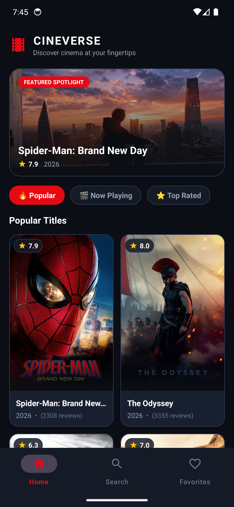
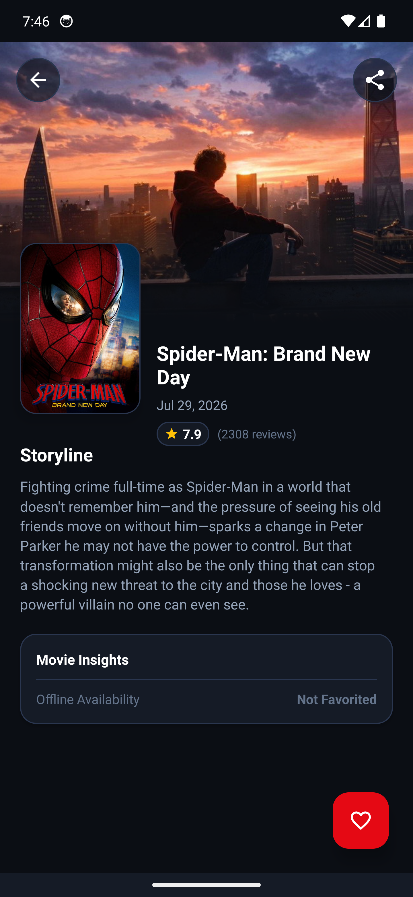
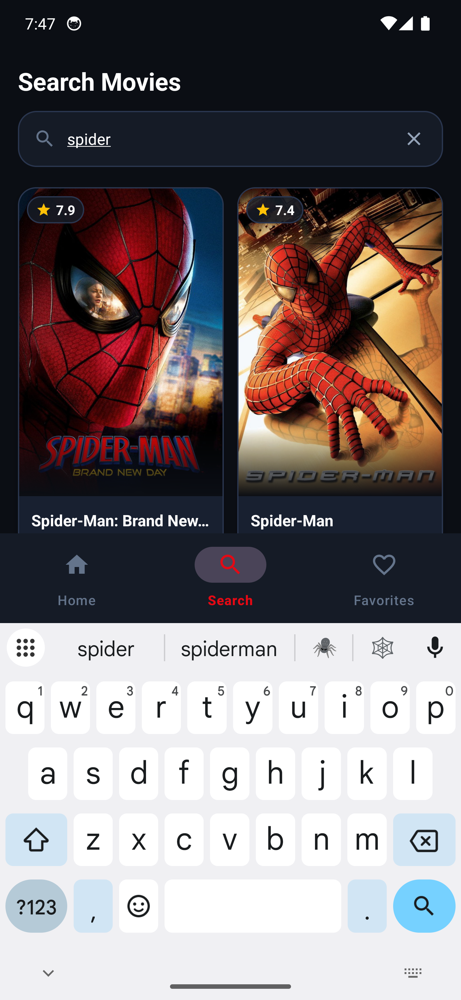
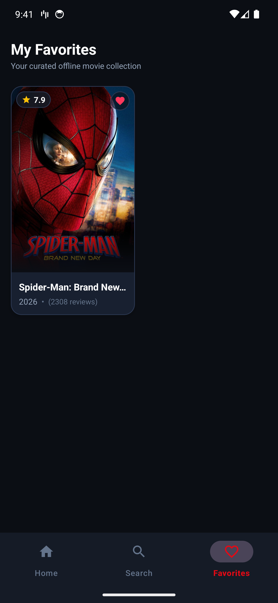
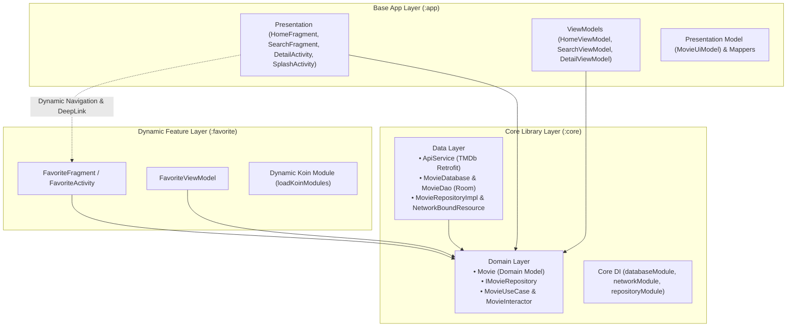
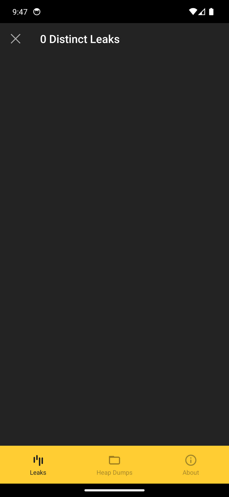

# 🎬 CineVerse - Android Capstone Project

<p align="center">
  
  
  
  
  
  
</p>

---

## 📖 Overview

**CineVerse** is a modern, modular Android application built as a Capstone project for the **Dicoding Android Developer Expert** curriculum. The app interacts with the **TheMovieDB (TMDb) API** to deliver a cinematic movie discovery and offline collection experience adhering to industry best practices, Clean Architecture, Modularization, Dynamic Feature Delivery, Reactive Streams, and robust security standards.

---

## 📱 Screenshots

<p align="center">
  
  
  
  
</p>

<p align="center">
  <em>From left to right: Home (Featured & Category Filters), Movie Details, Real-time Debounced Search, and Offline Encrypted Favorites</em>
</p>

---

## ✨ Features

- **🔥 Discovery & Category Filtering**: Browse popular movies, now playing titles in theaters, and all-time top-rated cinema.
- **⚡ Live Reactive Search**: Real-time search powered by Kotlin Coroutine Flow with `debounce(300)` to optimize network bandwidth and user experience.
- **🎬 Cinematic Movie Details**: Rich backdrop visual header, voting average, vote counts, release dates, storylines, and movie sharing.
- **❤️ Offline Favorite Collection**: Save movies to a secure, locally encrypted database accessible anytime without an internet connection.
- **🧩 Dynamic Feature Delivery**: Modularized `:favorite` feature delivered dynamically on-demand with Jetpack Navigation deep linking.
- **✨ Polished Cinema UI**: Material 3 Obsidian & Gold cinema theme, Shimmer loading placeholders, and smooth transitions.

---

## 🏛️ Architecture & Modularization

The project strictly follows **Clean Architecture** principles and **Multi-Module** separation of concerns:

```text
Capstone/
├── app/                  # Base Application Module (Presentation Layer)
│   ├── presentation/     # UI, Activities, Fragments, ViewModels, UI Models
│   └── di/               # AppModule for Presentation ViewModels
├── core/                 # Shared Android Library Module
│   ├── data/             # Remote API (Retrofit), Local DB (Room + SQLCipher), Repository Implementation
│   ├── domain/           # Pure Business Logic, Domain Models, Use Cases, Repository Interfaces
│   └── di/               # Core DI (Network, Database, Repository)
└── favorite/             # Dynamic Feature Module
    ├── src/              # FavoriteFragment, FavoriteViewModel, Dynamic Navigation
    └── di/               # On-demand Favorite Koin Module
```



---

## 🛡️ Security Implementation

1. **Database Encryption (SQLCipher)**:
   - All offline movie bookmarks in Room are encrypted using **SQLCipher** (`net.zetetic:android-database-sqlcipher:4.5.4`) with 256-bit passphrase hashing.
   - Configured in [CoreModule.kt](core/src/main/java/com/example/capstone/core/di/CoreModule.kt).
2. **Network Certificate Pinning (OkHttp)**:
   - SSL Certificate Pinning via OkHttp `CertificatePinner` locking public key hashes for `api.themoviedb.org` to prevent Man-in-the-Middle (MITM) attacks.
3. **Code Obfuscation & Resource Shrinking (ProGuard / R8)**:
   - Minification, dead-code removal, and resource shrinking enabled in release build with comprehensive rules in `app/proguard-rules.pro` and `favorite/proguard-rules.pro`.

---

## ⚡ Performance & Zero Memory Leaks

- **LeakCanary 2.14**: Integrated in `debugImplementation` to actively monitor View and Fragment lifecycles.
- **0 Distinct Leaks**: Strict lifecycle cleanup implemented across all Fragment ViewHolders, ViewBindings, and Coroutine collectors.

<p align="center">
  
</p>

---

## 🔄 Continuous Integration (CI)

Automated testing and APK build pipeline configured via **GitHub Actions** in [`.github/workflows/android.yml`](.github/workflows/android.yml):

- Automated JDK 17 setup & dependency caching.
- Automated unit test validation (`./gradlew testDebugUnitTest`).
- Automated debug APK packaging (`./gradlew assembleDebug`).
- Artifact publishing for build verification.

---

## 🛠️ Tech Stack & Libraries

- **Language**: Kotlin 1.9.24
- **Architecture**: Clean Architecture (Presentation, Domain, Data)
- **Dependency Injection**: Koin 3.5.6 (with dynamic on-demand loading)
- **Asynchronous / Reactive**: Kotlin Coroutines & Flow (`StateFlow`, `debounce`, `flatMapLatest`)
- **Networking**: Retrofit 2.11.0, OkHttp 4.12.0, Gson Converter
- **Local Persistence**: Room Database 2.6.1 + SQLCipher 4.5.4
- **Image Loading**: Glide 4.16.0
- **UI Components**: Android XML, ViewBinding, Material 3, Facebook Shimmer, SwipeRefreshLayout
- **Navigation**: Jetpack Navigation 2.8.5 (Dynamic Features & DeepLinks)
- **Quality Assurance**: LeakCanary 2.14, JUnit 4, Kotlinx Coroutines Test

---

## 🚀 Getting Started

### Prerequisites
- Android Studio Ladybug | 2024.2.1+ or newer
- JDK 17
- Android SDK API 34+

### Clone and Run
```bash
# 1. Clone the repository
git clone https://github.com/<your-username>/CineVerse-Capstone.git
cd CineVerse-Capstone

# 2. Run unit tests
./gradlew testDebugUnitTest

# 3. Assemble and install on connected device/emulator
./gradlew installDebug
```

---

## 📄 License
This project is developed for educational purposes as part of the **Dicoding Indonesia** Android Developer Expert learning path.
