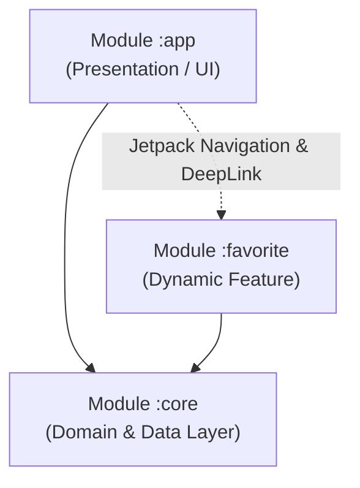

# CineVerse

CineVerse adalah aplikasi katalog film Android yang dibangun menggunakan **TheMovieDB (TMDb) API**. Proyek ini dibuat untuk memenuhi submission **Capstone Project** pada kelas Menjadi Android Developer Expert di Dicoding.

Aplikasi ini mengimplementasikan standar arsitektur modern Android, meliputi **Clean Architecture**, **Modularization (Multi-Module & Dynamic Feature)**, **Reactive Programming dengan Coroutines & Flow**, **Dependency Injection dengan Koin**, serta aspek **Security** dan **Performance**.

---

## Screenshots

| Home (Katalog Film) | Detail Movie | Live Search | Favorites (Offline Room) |
| :---: | :---: | :---: | :---: |
|  |  |  |  |

---

## Fitur Utama & Fitur Tambahan

1. **Katalog Film (Home)**:
   - Menampilkan daftar film populer, sedang tayang (*Now Playing*), dan rating tertinggi (*Top Rated*) menggunakan category filter.
   - Dilengkapi *featured banner* di bagian atas.
2. **Detail Film**:
   - Menampilkan informasi lengkap: poster, backdrop, sinopsis (*storyline*), rating, dan jumlah ulasan.
   - Tombol Floating Action Button (FAB) untuk menyimpan atau menghapus film dari daftar favorit.
   - Tombol Share untuk membagikan info film ke aplikasi lain.
3. **Favorite Movie (Dynamic Feature Module `:favorite`)**:
   - Menampilkan daftar film yang telah disimpan pengguna ke database lokal Room.
   - Dapat diakses secara offline.
4. **Live Search**:
   - Pencarian film secara real-time menggunakan reactive stream `debounce(300ms)` untuk mengurangi beban request ke network.
5. **UI & UX**:
   - Tema gelap (*Dark Theme*).
   - Efek *Shimmer loading* untuk placeholder saat memuat data.
   - Penanganan *empty state* dan *error state* dengan tombol *Try Again*.

---

## Arsitektur & Modularisasi

Aplikasi ini menggunakan **Clean Architecture** yang dibagi ke dalam 3 modul:

```text
Capstone/
├── app/                  # Base Application / Presentation Layer (UI, ViewModel, NavGraph)
├── core/                 # Android Library Module (Data, Domain, Network, Database, DI)
└── favorite/             # Dynamic Feature Module (Halaman Favorit & On-demand DI)
```



### Pemisahan Model (3 Distinct Models)
Untuk mematuhi prinsip Clean Architecture, model dipisahkan pada setiap layernya:
- **Data Layer**: `MovieResponse` (DTO network) dan `MovieEntity` (Entity Room database).
- **Domain Layer**: `Movie` (Pure Kotlin domain model tanpa dependensi framework).
- **Presentation Layer**: `MovieUiModel` (Model siap pakai untuk UI).
- Dihubungkan menggunakan `DataMapper` di modul `:core` dan `DomainToPresentationMapper` di modul `:app`.

---

## Kriteria Capstone Akhir

### 1. Jetpack Navigation Antar Module
- Menggunakan `DynamicNavHostFragment` pada `activity_main.xml`.
- Navigasi ke modul Dynamic Feature `:favorite` menggunakan Navigation Graph (`nav_graph.xml`) dan DeepLink `cineverse://favorite`.

### 2. Security
- **Database Encryption**: Database Room dienkripsi menggunakan **SQLCipher** (`net.zetetic:android-database-sqlcipher:4.5.4`) dengan `SupportFactory`.
- **Certificate Pinning**: Menggunakan OkHttp `CertificatePinner` dengan SHA-256 public key hash dari SSL TMDb API (`api.themoviedb.org`).
- **Code Obfuscation (ProGuard / R8)**: Mengaktifkan `isMinifyEnabled = true` dan `isShrinkResources = true` pada release build, lengkap dengan rules di `proguard-rules.pro`.

### 3. Performance & Memory Leak (LeakCanary)
- Menerapkan **LeakCanary** (`leakcanary-android:2.14`) pada `debugImplementation`.
- Seluruh adapter dan binding didetach pada `onDestroyView()` untuk memastikan **0 Distinct Leaks**.

<p align="center">
  
</p>

### 4. Continuous Integration (CI)
- Menggunakan **GitHub Actions** (`.github/workflows/android.yml`) untuk menjalankan automated unit tests dan build APK saat push/pull request.

---

## Tech Stack & Dependencies

- **Language**: Kotlin
- **Architecture**: Clean Architecture (MVVM)
- **Dependency Injection**: Koin
- **Asynchronous / Reactive**: Kotlin Coroutines & Flow (`StateFlow`, `debounce`, `flatMapLatest`)
- **Networking**: Retrofit 2, OkHttp 4, Gson
- **Local Database**: Room + SQLCipher
- **Image Loader**: Glide
- **UI**: Android XML, ViewBinding, Material 3, Shimmer
- **Navigation**: Jetpack Navigation Component (Dynamic Features)
- **Testing**: JUnit 4, Kotlinx Coroutines Test
- **Tooling**: LeakCanary, ProGuard / R8

---

## Cara Menjalankan Project

1. Clone repository ini:
   ```bash
   git clone https://github.com/farrasariffadhila/CineVerse-Capstone.git
   cd CineVerse-Capstone
   ```
2. Buka project di **Android Studio** (disarankan versi Ladybug / 2024.2+ dengan JDK 17).
3. Jalankan unit test untuk memverifikasi fungsionalitas mapper dan use case:
   ```bash
   ./gradlew testDebugUnitTest
   ```
4. Jalankan aplikasi ke emulator atau device fisik:
   ```bash
   ./gradlew installDebug
   ```
